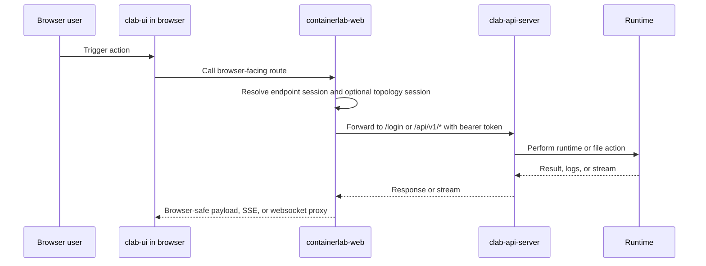
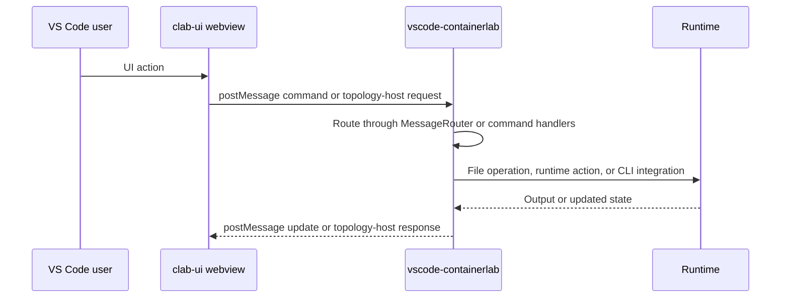
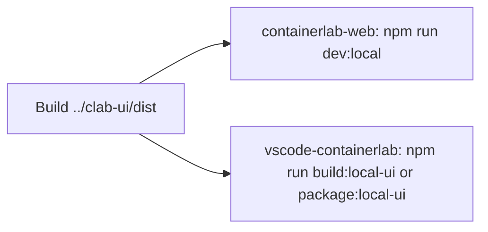

# 2. End-to-End Flows

This page follows the common request and message paths through the platform.

## Browser-hosted flow

What matters here:

- The browser never talks to the runtime directly.
- `containerlab-web` translates browser-safe routes into API-server calls.
- Auth, superuser checks, and ownership checks happen in `clab-api-server`, not in `clab-ui`.

## VS Code-hosted flow

What matters here:

- There is no mandatory HTTP gateway in the VS Code path.
- The extension host owns file access, runtime access, and panel lifecycle.
- The webview remains a presentation layer plus message client.

## Local development flow with sibling `clab-ui`

The key rule is simple: if you changed `clab-ui`, rebuild it before expecting the consumers to reflect that change.

## Runtime behavior classes

| Class | Examples | Transport |
|---|---|---|
| Request/response | login, list labs, save topology file, inspect lab | HTTP |
| Long-running stream | platform events, topology file events | streaming HTTP bridged to SSE in the browser host |
| Interactive stream | terminal, VNC | websocket |
| Local extension command | deploy, destroy, inspect, capture inside VS Code | command and message bridge |

## Failure surfaces by flow

| Flow | Typical failure | First place to inspect |
|---|---|---|
| Browser UI -> web host | wrong endpoint session or route mismatch | `containerlab-web/server/*.ts` |
| Web host -> API server | auth header, route, or query mismatch | `containerlab-web/server/clabApiClient.ts`, `clab-api-server/internal/api/routes.go` |
| API server -> runtime | privilege or ownership failure | `clab-api-server/internal/api/*.go` |
| Webview -> extension host | message or command mapping drift | `vscode-containerlab/src/reactTopoViewer/extension/panel/MessageRouter.ts` |
