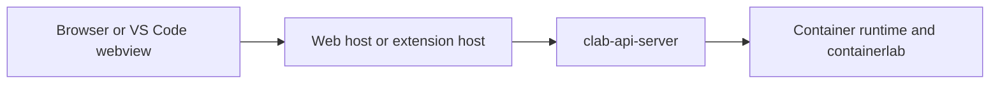

# 8. Security and Operations

This page summarizes where trust boundaries actually are, which layer enforces what, and what has to be true before the platform is safe to operate.

## Security boundaries

The highest-risk boundary in the browser-hosted path is between the API server and the runtime. In the VS Code path, the equivalent boundary is between the extension host and the local runtime environment.

## What enforces access at each layer

| Layer | Enforcement mechanism | Notes |
|---|---|---|
| Browser host | browser session cookie + saved endpoint sessions | only chooses and forwards endpoint context; not the final policy authority |
| API authentication | JWT bearer token | enforced on `/api/v1/*` |
| API authorization | Linux groups + handler-specific policy | `API_USER_GROUP`, `SUPERUSER_GROUP`, and explicit handler checks |
| Resource ownership | lab/container ownership helpers | often returns `404` to conceal unauthorized resources |
| VS Code extension | local activation checks and environment reachability | not the same security model as the API server |
| Runtime access | host privileges and runtime availability | without this, authenticated requests still fail |

## Operational constraints

| Constraint | Consequence if ignored |
|---|---|
| `clab-api-server` must run with sufficient host privileges | runtime, capture, and network operations fail or become unsafe |
| Group membership must be managed intentionally | users are over-privileged or unexpectedly blocked |
| `JWT_SECRET` must not be left at an insecure default | bearer tokens are not trustworthy |
| `CORS_ALLOWED_ORIGINS` must match real browser origins | browser-hosted flows fail despite otherwise-correct code |
| `TRUSTED_PROXIES` should be configured explicitly | generated URLs and proxy-aware behavior can drift |
| VS Code users need local environment access | the extension can activate but still fail to perform runtime actions |

## Rollout checklist

1. Set a real `JWT_SECRET`.
2. Review `API_USER_GROUP` and `SUPERUSER_GROUP` membership.
3. Configure `CORS_ALLOWED_ORIGINS` for every browser origin you intend to support.
4. Configure `TRUSTED_PROXIES` if the API server sits behind a proxy.
5. Verify the API server process can reach the container runtime.
6. Verify browser-host and VS Code-host flows separately, because they fail differently.

## Things the shared UI does not guarantee

!!! warning "Shared UI is not shared authorization"
    `clab-ui` makes the UX reusable. It does not make runtime access safe by itself.

Do not assume any of the following just because the UI renders correctly:

- the API bearer token is valid
- the user belongs to the required Linux groups
- the user owns the lab or container they are touching
- the runtime and capture tools are reachable
- the extension host has the local privileges it needs
