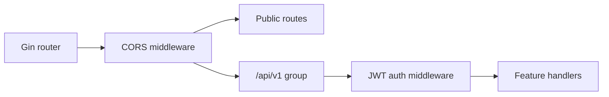
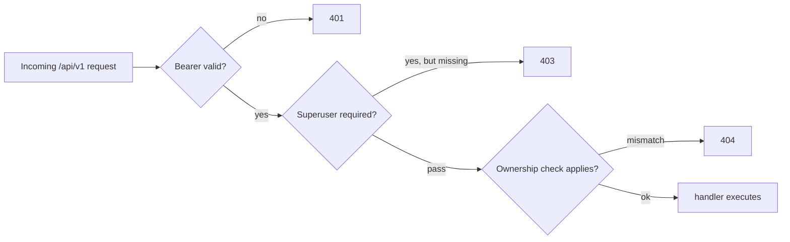

# 12. API Endpoint Taxonomy

This page summarizes the `clab-api-server` endpoint families that matter most to the UI hosts, plus the auth and ownership behavior that explains many of the observed status codes.

## Request pipeline

Public routes include:

- `GET /health`
- `POST /login`
- `GET /swagger/*any`
- `GET /redoc`

Everything under `/api/v1/*` is authenticated.

## Status patterns worth remembering

| Code | Common meaning here |
|---|---|
| `200` | normal success |
| `201` | resource created |
| `204` | successful preflight or empty success |
| `400` | parse or validation failure |
| `401` | bearer token missing, malformed, expired, or invalid |
| `403` | action is forbidden, often because superuser privileges are required |
| `404` | resource genuinely missing or intentionally concealed by ownership rules |
| `409` | state conflict |
| `410` | terminal session is no longer active |
| `500` | internal or runtime failure |
| `502` | upstream proxy issue in VNC proxy path |
| `503` | required backend feature is unavailable |

## Auth and ownership helpers

| Helper | Effect |
|---|---|
| `AuthMiddleware` | validates bearer token and injects `username` into request context |
| `requireSuperuser` | blocks superuser-only handlers with `403` |
| `verifyLabOwnership` | validates lab visibility and often returns `404` on mismatch |
| `verifyContainerOwnership` | validates container-level visibility and often returns `404` on mismatch |

## Endpoint families

### Auth and documentation

| Method | Path | Notes |
|---|---|---|
| `POST` | `/login` | Linux-user login through PAM plus group checks |
| `GET` | `/health` | public health check |
| `GET` | `/swagger/*any` | Swagger UI assets |
| `GET` | `/redoc` | ReDoc UI |

### Platform streams and health

| Method | Path | Notes |
|---|---|---|
| `GET` | `/api/v1/events` | NDJSON event stream |
| `GET` | `/api/v1/health/metrics` | metrics endpoint, typically superuser-only |

### Labs, topology documents, and files

| Method | Path |
|---|---|
| `GET` | `/api/v1/labs` |
| `POST` | `/api/v1/labs` |
| `POST` | `/api/v1/labs/archive` |
| `GET` | `/api/v1/labs/topology/files` |
| `GET` | `/api/v1/labs/{labName}` |
| `DELETE` | `/api/v1/labs/{labName}` |
| `PUT` | `/api/v1/labs/{labName}` |
| `POST` | `/api/v1/labs/{labName}/deploy` |
| `GET` | `/api/v1/labs/{labName}/interfaces` |
| `POST` | `/api/v1/labs/{labName}/save` |
| `POST` | `/api/v1/labs/{labName}/exec` |
| `GET` | `/api/v1/labs/{labName}/topology/yaml` |
| `PUT` | `/api/v1/labs/{labName}/topology/yaml` |
| `GET` | `/api/v1/labs/{labName}/topology/annotations` |
| `PUT` | `/api/v1/labs/{labName}/topology/annotations` |
| `GET` | `/api/v1/labs/{labName}/topology/events` |
| `GET` | `/api/v1/labs/{labName}/topology/file` |
| `HEAD` | `/api/v1/labs/{labName}/topology/file` |
| `PUT` | `/api/v1/labs/{labName}/topology/file` |
| `DELETE` | `/api/v1/labs/{labName}/topology/file` |
| `POST` | `/api/v1/labs/{labName}/topology/file/rename` |
| `GET` | `/api/v1/labs/{labName}/ui/icons` |
| `POST` | `/api/v1/labs/{labName}/ui/icons/reconcile` |

### Node, SSH, and terminal flows

| Method | Path | Notes |
|---|---|---|
| `POST` | `/api/v1/labs/{labName}/nodes/{nodeName}/ssh` | request SSH access |
| `POST` | `/api/v1/labs/{labName}/nodes/{nodeName}/terminal-sessions` | create terminal session |
| `GET` | `/api/v1/labs/{labName}/nodes/{nodeName}/logs` | logs lookup or stream-like response |
| `GET` | `/api/v1/terminal-sessions/{sessionId}` | terminal session status |
| `DELETE` | `/api/v1/terminal-sessions/{sessionId}` | terminate terminal session |
| `GET` | `/api/v1/terminal-sessions/{sessionId}/stream` | terminal websocket upgrade |
| `GET` | `/api/v1/ssh/sessions` | list SSH sessions |
| `DELETE` | `/api/v1/ssh/sessions/{port}` | terminate SSH session |

### Capture and VNC

| Method | Path |
|---|---|
| `POST` | `/api/v1/labs/{labName}/capture/packetflix` |
| `POST` | `/api/v1/labs/{labName}/capture/wireshark-vnc-sessions` |
| `GET` | `/api/v1/capture/wireshark-vnc-sessions/{sessionId}/ready` |
| `DELETE` | `/api/v1/capture/wireshark-vnc-sessions/{sessionId}` |
| `ANY` | `/api/v1/capture/wireshark-vnc-sessions/{sessionId}/vnc/*proxyPath` |

### UI support endpoints

| Method | Path |
|---|---|
| `GET` | `/api/v1/ui/custom-nodes` |
| `PUT` | `/api/v1/ui/custom-nodes` |
| `POST` | `/api/v1/ui/custom-nodes` |
| `DELETE` | `/api/v1/ui/custom-nodes/{name}` |
| `POST` | `/api/v1/ui/custom-nodes/default` |
| `GET` | `/api/v1/ui/icons` |
| `POST` | `/api/v1/ui/icons` |
| `DELETE` | `/api/v1/ui/icons/{iconName}` |

### Tools, version, users, and generation

| Method | Path |
|---|---|
| `POST` | `/api/v1/generate` |
| `GET` | `/api/v1/version` |
| `GET` | `/api/v1/version/check` |
| `GET` | `/api/v1/tools/edgeshark/status` |
| `POST` | `/api/v1/tools/edgeshark/install` |
| `POST` | `/api/v1/tools/edgeshark/uninstall` |
| `POST` | `/api/v1/tools/disable-tx-offload` |
| `POST` | `/api/v1/tools/veth` |
| `POST` | `/api/v1/tools/vxlan` |
| `DELETE` | `/api/v1/tools/vxlan` |
| `GET` | `/api/v1/tools/netem/show` |
| `POST` | `/api/v1/tools/netem/set` |
| `POST` | `/api/v1/tools/netem/reset` |
| `POST` | `/api/v1/tools/certs/ca` |
| `POST` | `/api/v1/tools/certs/sign` |
| `GET` | `/api/v1/users` |
| `POST` | `/api/v1/users` |
| `GET` | `/api/v1/users/{username}` |
| `PUT` | `/api/v1/users/{username}` |
| `DELETE` | `/api/v1/users/{username}` |
| `PUT` | `/api/v1/users/{username}/password` |

## Decision flow for auth and ownership

## Source anchors

- `clab-api-server/cmd/server/main.go`
- `clab-api-server/internal/api/routes.go`
- `clab-api-server/internal/api/middleware.go`
- `clab-api-server/internal/api/helpers.go`
- `clab-api-server/internal/api/*_handlers.go`
