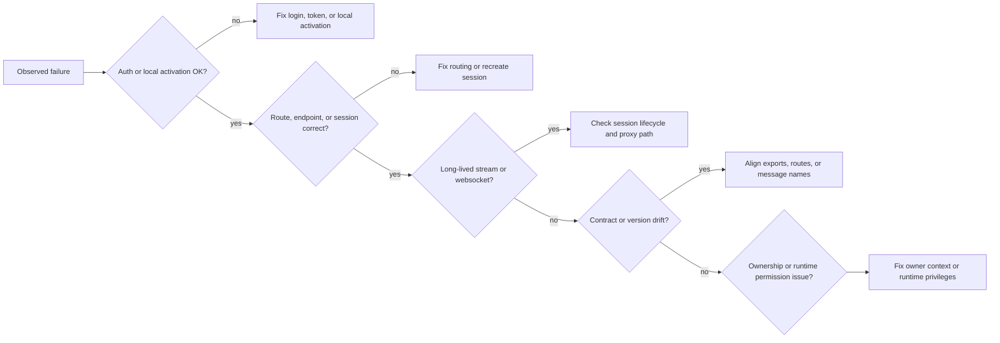

# 15. Failure Mode Atlas

This is the cross-repo failure map for the breakages that show up most often during integration, local development, and operations.

## Auth failures

| Failure mode | Trigger | Symptom | First check | Remediation |
|---|---|---|---|---|
| API login rejection | bad credentials or missing required group | login fails, no token issued | API login path and Linux group membership | fix credentials or group membership, then log in again |
| JWT validation failure | expired token or secret mismatch | `401` across `/api/v1/*` | API auth middleware and token age | log in again and verify server config |
| browser endpoint session expired | saved endpoint token no longer works | browser routes return `401` even though the UI looks "logged in" | `containerlab-app` endpoint status and `/auth/me` | reconnect the endpoint or log in again |
| extension activation blocked | local user lacks required groups or runtime access | extension does not initialize fully | `vscode-containerlab` activation checks and Docker access | fix local group membership and runtime access |

## Routing and session failures

| Failure mode | Trigger | Symptom | First check | Remediation |
|---|---|---|---|---|
| web route mismatch | browser-facing route and upstream mapping drifted | `404`, `405`, or unexpected response shape | `containerlab-app/packages/app-server/src/*.ts` | align the browser route with the intended upstream behavior |
| stale topology session | topology session id outlived the current context | snapshot or command route returns `404` | `topologySessionManager.ts` and active browser session state | recreate the topology session |
| wrong endpoint selected | browser session has multiple endpoints and the wrong one is chosen | requests hit the wrong lab inventory or return confusing auth failures | endpoint-selection logic in `middleware.ts` and request target data | choose the intended endpoint explicitly or clean up stale endpoints |
| capture-session mapping drift | capture session no longer maps to the endpoint that created it | VNC ready, close, or websocket paths fail unexpectedly | `captureSessionStore.ts` and capture proxy code | recreate the capture session |

## Streaming and websocket failures

| Failure mode | Trigger | Symptom | First check | Remediation |
|---|---|---|---|---|
| event stream failure | upstream NDJSON stream closed or auth expired | browser event feed stops updating | `eventsProxy.ts` and API `/api/v1/events` |
| topology event stream failure | stale topology session or path mismatch | browser does not react to external file changes | `topologyEventsProxy.ts` and topology session state | recreate the topology session |
| terminal websocket failure | terminal session no longer exists | websocket closes immediately | terminal session creation and `terminalStreamProxy.ts` | create a new terminal session |
| VNC websocket failure | capture session not ready or no longer exists | noVNC page loads but websockify fails | capture readiness route and `captureVncStreamProxy.ts` | wait for readiness or recreate the session |

## Local shared-package failures

| Failure mode | Trigger | Symptom | First check | Remediation |
|---|---|---|---|---|
| missing `clab-ui/dist` | consumer started in local mode before a build | consumer startup fails fast or cannot resolve package aliases | local-ui guard scripts and `dist/` contents | build `clab-ui` first |
| stale `dist/` | shared package changed without rebuild | runtime drift or missing exported symbol | rebuild output timestamp and consumer restart state | rebuild `clab-ui` and restart the consumer |
| local mode leaked into normal packaging | local env still set during packaging | wrong artifact is bundled or tested | build scripts and environment | use the normal scripts for published-package validation |

## Version and contract drift

| Failure mode | Trigger | Symptom | First check | Remediation |
|---|---|---|---|---|
| consumer imports repo internals | package update removes or moves an internal file | compile-time or runtime import breakage | consumer import graph | migrate to public package exports |
| host contract drift | package expects host methods the consumer does not implement | semantic UI actions no-op or throw | `clab-ui` host contract versus host implementation | implement the missing host behavior |
| web route drift | browser helper expects old route or payload shape | browser-only runtime regressions | `containerlab-app/packages/standalone-runtime/src/runtimeApi.ts` and `packages/app-server/src/*.ts` | realign browser helper and server proxy |
| VS Code message drift | webview emits messages with no handler or wrong payload | VS Code-only regressions | `MessageRouter.ts` and feature webview code | realign message names and payloads |

## Ownership and permission failures

| Failure mode | Trigger | Symptom | First check | Remediation |
|---|---|---|---|---|
| non-owner touches a lab | user targets a lab they do not own | `404` or policy-specific denial patterns | API ownership helpers | retry as the owner or a superuser where appropriate |
| non-owner touches a container | user targets a container they do not own | node-level actions fail with concealed-not-found semantics | `verifyContainerOwnership` path | retry with correct owner context |
| runtime privilege missing | server or extension host lacks runtime access | auth succeeds, but runtime actions still fail | server privilege model or local Docker access | fix runtime permissions |

## Triage order that usually works

## First-log map

| Area | File or hotspot |
|---|---|
| web auth and endpoint sessions | `containerlab-app/packages/app-server/src/auth.ts`, `packages/app-server/src/middleware.ts` |
| web topology session logic | `containerlab-app/packages/app-server/src/topologyProxy.ts`, `packages/app-server/src/topologySessionManager.ts` |
| web runtime and capture proxies | `containerlab-app/packages/app-server/src/runtimeProxy.ts` |
| terminal websocket proxy | `containerlab-app/packages/app-server/src/terminalStreamProxy.ts` |
| VNC websocket proxy | `containerlab-app/packages/app-server/src/captureVncStreamProxy.ts` |
| API auth and ownership | `clab-api-server/internal/api/middleware.go`, `helpers.go` |
| API lab and capture handlers | `clab-api-server/internal/api/lab_handlers.go`, `capture_handlers.go` |
| VS Code activation | `vscode-containerlab/src/extension.ts` |
| VS Code topology bridge | `vscode-containerlab/src/reactTopoViewer/extension/panel/MessageRouter.ts` |

## Preventive controls

1. Treat the public `@srl-labs/clab-ui` exports as the only supported integration surface.
2. Keep browser endpoint-session and topology-session logging explicit enough to diagnose selection drift.
3. Keep local-ui workflows strict so stale `dist/` is obvious.
4. Revalidate web route mappings whenever the API server route surface changes.
5. Revalidate VS Code message and command mappings whenever semantic command names change.
