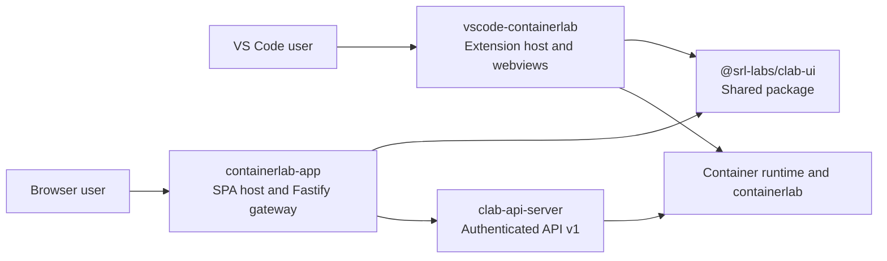

# clab-ui Platform Guide

This guide explains how `clab-ui`, `containerlab-app`, `clab-api-server`, and `vscode-containerlab` work together as one platform. It is written for maintainers and integrators who need to understand ownership boundaries, integration contracts, and failure modes.

!!! info "Good starting points"
    - Want the shortest useful full-system orientation? Start with [0. Platform Deep Dive](00-platform-deep-dive.md).
    - Debugging browser-hosted behavior? Jump to [11. Web Route and Proxy Matrix](11-web-route-and-proxy-matrix.md).
    - Verifying package and runtime contracts? Use [14. clab-ui Contract Spec](14-clab-ui-contract-spec.md).

## What this guide covers

- Which repo owns which responsibility
- How browser-hosted and VS Code-hosted flows differ
- Which contracts must stay stable between repos
- Where auth, authorization, ownership, and runtime access are enforced
- How to debug route, session, transport, and version drift problems

## Read this in order if you are...

### New to the platform

1. [0. Platform Deep Dive](00-platform-deep-dive.md)
2. [1. Big Picture](01-big-picture.md)
3. [2. End-to-End Flows](02-end-to-end-flows.md)
4. The repo-specific pages: [3](03-clab-ui.md) through [6](06-vscode-containerlab.md)

### Working on local development or release flow

1. [7. Local Dev and Release](07-local-dev-and-release.md)
2. [10. Reference Matrix](10-reference-matrix.md)

### Debugging web-hosted runtime behavior

1. [5. containerlab-app](05-containerlab-app.md)
2. [11. Web Route and Proxy Matrix](11-web-route-and-proxy-matrix.md)
3. [12. API Endpoint Taxonomy](12-api-endpoint-taxonomy.md)
4. [15. Failure Mode Atlas](15-failure-mode-atlas.md)

### Debugging VS Code-hosted behavior

1. [6. vscode-containerlab](06-vscode-containerlab.md)
2. [13. VS Code Bridge Contract](13-vscode-bridge-contract.md)
3. [14. clab-ui Contract Spec](14-clab-ui-contract-spec.md)
4. [15. Failure Mode Atlas](15-failure-mode-atlas.md)

## System map

## Responsibility split

| Layer | Owns | Does not own |
|---|---|---|
| `clab-ui` | Shared UI, topology host contracts, session client, feature bootstrappers | Container runtime access, Linux auth, API policy |
| `containerlab-app` | Browser hosting, endpoint sessions, topology sessions, API proxying, stream/websocket forwarding | Runtime authority, Linux user management |
| `clab-api-server` | JWT auth, Linux-group authorization, ownership checks, runtime operations, file-scoped topology APIs | Browser hosting, VS Code webviews |
| `vscode-containerlab` | VS Code command bridge, panel lifecycle, file I/O, local CLI-driven workflows | Central browser gateway role |

## Stable boundaries you should treat as contracts

- The `@srl-labs/clab-ui` export map in `clab-ui/package.json`
- The `ClabUiHost` and topology session contracts in `@srl-labs/clab-ui/host` and `@srl-labs/clab-ui/session`
- The browser-facing route surface implemented by `containerlab-app`
- The `/api/v1/*` semantics exposed by `clab-api-server`
- The VS Code command and message bridge implemented by `vscode-containerlab`

## What changes most often

- Exact web proxy route mappings
- Feature-specific message names in the VS Code bridge
- Runtime and capture flows
- Local development glue between the sibling repos

## Source anchors for this guide

- `clab-ui/README.md`, `clab-ui/INTEGRATORS.md`, `clab-ui/package.json`
- `containerlab-app/packages/app-server/src/index.ts`, `containerlab-app/packages/app-server/src/*.ts`, `containerlab-app/packages/standalone-runtime/src/*.ts`
- `clab-api-server/cmd/server/main.go`, `clab-api-server/internal/api/*.go`
- `vscode-containerlab/src/extension.ts`, `vscode-containerlab/src/reactTopoViewer/extension/*`, `vscode-containerlab/esbuild.config.js`
